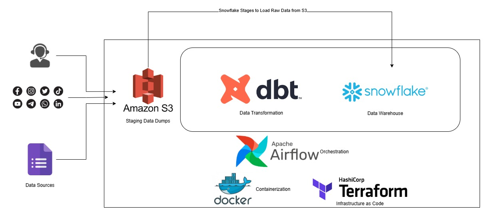
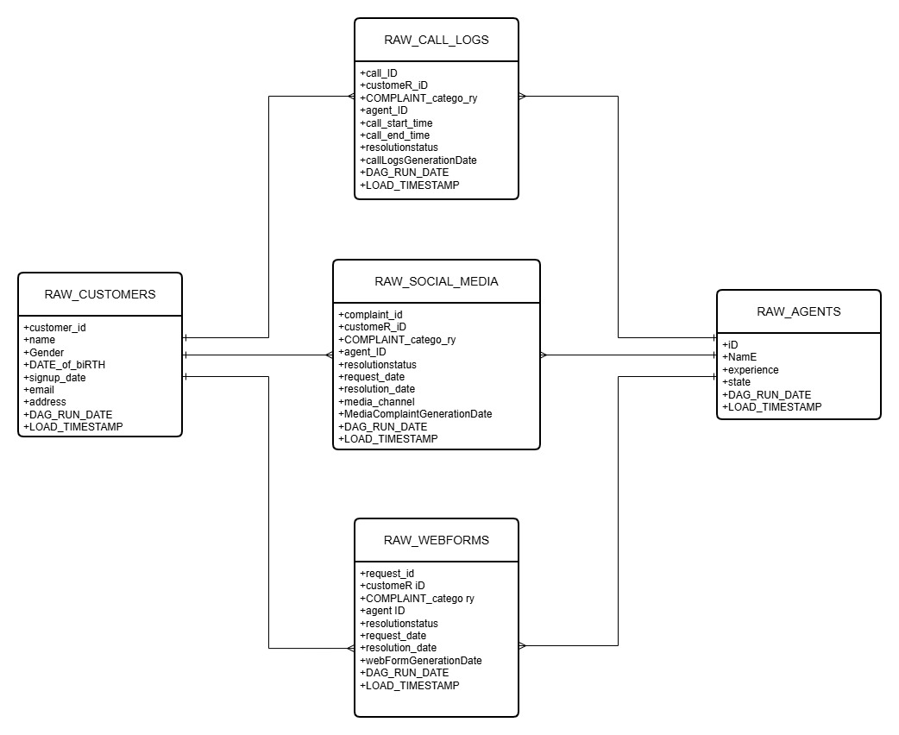
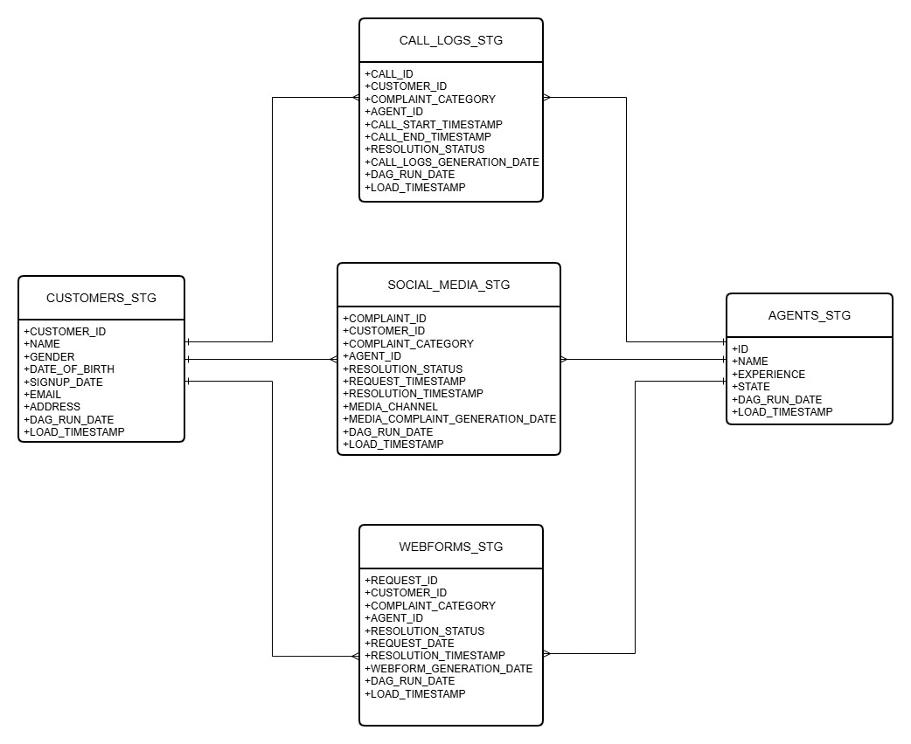
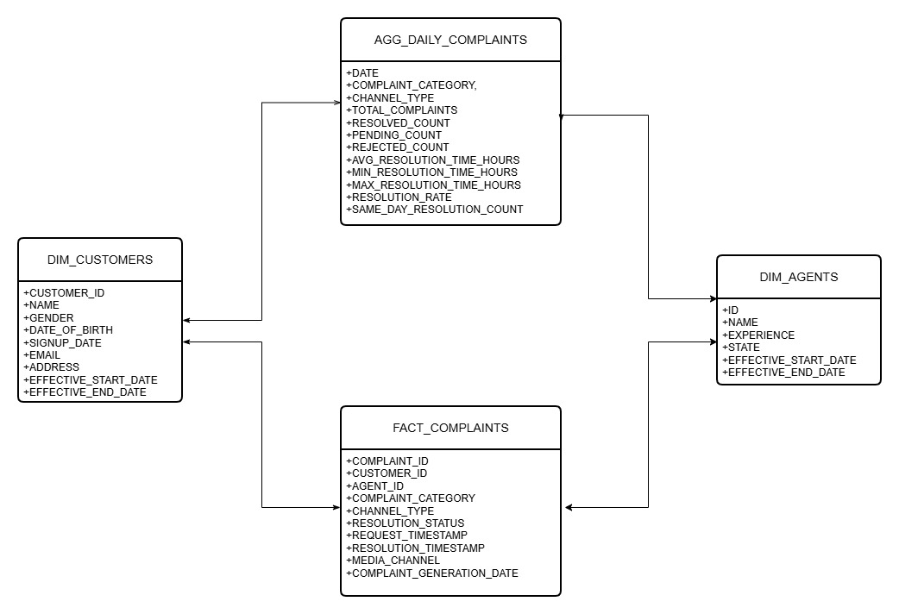

# CoreTelecoms Unified Customer Experience Data Platform


## 📋 Table of Contents
- [Project Overview](#project-overview)
- [Solution Architecture](#solution-architecture)
- [Technology Stack](#technology-stack)
- [Project Structure](#project-structure)
- [Data Sources](#data-sources)
- [Data Pipeline Architecture](#data-pipeline-architecture)
- [Infrastructure as Code](#infrastructure-as-code)
- [Setup and Installation](#setup-and-installation)
- [Pipeline Orchestration](#pipeline-orchestration)
- [Data Modeling](#data-modeling)
- [CI/CD Pipeline](#cicd-pipeline)
- [Best Practices Implemented](#best-practices-implemented)
- [How to Run](#how-to-run)
- [Monitoring and Alerts](#monitoring-and-alerts)
- [Future Enhancements](#future-enhancements)

---
## 🎯 Project Overview

The **CoreTelecoms Unified Customer Experience Data Platform** is a production-grade, end-to-end data engineering solution designed to consolidate customer complaint data from multiple sources into a unified, analytics-ready data warehouse. This platform enables CoreTelecoms to gain actionable insights into customer complaints, reduce churn, and improve customer satisfaction.

### Achievements
- ✅ Unified data from 5+ diverse sources (CSV, JSON, PostgreSQL, Google Sheets)
- ✅ Automated daily data ingestion and transformation pipelines
- ✅ Production-grade orchestration with Apache Airflow
- ✅ Infrastructure fully automated with Terraform
- ✅ Containerized deployment with Docker

---

## 🏗️ Architecture


The platform implements a modern **Medallion Architecture** (Bronze → Silver → Gold) with the following layers:

```
┌─────────────────────────────────────────────────────────────────────────┐
│                          DATA SOURCES                                    │
├──────────────┬──────────────┬──────────────┬──────────────┬────────────┤
│   AWS S3     │   AWS S3     │   AWS S3     │  PostgreSQL  │   Google   │
│  (Customers) │ (Call Logs)  │(Social Media)│ (Web Forms)  │   Sheets   │
│     CSV      │     CSV      │     JSON     │    Tables    │  (Agents)  │
└──────┬───────┴──────┬───────┴──────┬───────┴──────┬───────┴─────┬──────┘
       │              │              │              │             │
       └──────────────┴──────────────┴──────────────┴─────────────┘
                                 │
                    ┌────────────▼────────────┐
                    │   APACHE AIRFLOW 3.0    │
                    │   (Orchestration)       │
                    │   - Task Scheduling     │
                    │   - Dependency Mgmt     │
                    │   - Error Handling      │
                    └────────────┬────────────┘
                                 │
                    ┌────────────▼────────────┐
                    │     AWS S3 DATA LAKE    │
                    │      (RAW LAYER)        │
                    │   Parquet Format with   │
                    │   Metadata Tracking     │
                    └────────────┬────────────┘
                                 │
                    ┌────────────▼────────────┐
                    │   SNOWFLAKE WAREHOUSE   │
                    │                         │
                    │   ┌─────────────────┐   │
                    │   │ BRONZE LAYER    │   │
                    │   │ (Raw Landing)   │   │
                    │   └────────┬────────┘   │
                    │            │            │
                    │   ┌────────▼────────┐   │
                    │   │ SILVER LAYER    │   │
                    │   │ (Cleaned/       │   │
                    │   │  Standardized)  │   │
                    │   └────────┬────────┘   │
                    │            │            │
                    │   ┌────────▼────────┐   │
                    │   │  GOLD LAYER     │   │
                    │   │ (Analytics      │   │
                    │   │  Ready)         │   │
                    │   └─────────────────┘   │
                    └─────────────────────────┘
                                 │
                    ┌────────────▼────────────┐
                    │    CONSUMPTION LAYER    │
                    │  - BI Tools (Tableau,   │
                    │    Power BI)            │
                    │  - ML/Analytics         │
                    │  - Reporting Dashboards │
                    └─────────────────────────┘
```

### Data Flow
1. **Extraction**: Airflow DAGs extract data from multiple sources daily
2. **Raw Storage**: Data stored as Parquet files in S3 with metadata
3. **Landing (Bronze)**: Raw data loaded into Snowflake Bronze layer
4. **Transformation (Silver)**: dbt cleans, standardizes, and validates data
5. **Analytics (Gold)**: Business-ready datasets for consumption

---

## 🛠️ Technology Stack

### Orchestration & Workflow
- **Apache Airflow 3.0.6**: Workflow orchestration and scheduling
- **Astronomer Cosmos**: dbt integration with Airflow

### Data Processing & Transformation
- **dbt (Snowflake)**: Data transformation and modeling
- **Python 3.x**: Custom ETL logic
- **AWS Wrangler**: Pandas integration with AWS services

### Data Storage
- **Snowflake**: Cloud data warehouse (Bronze/Silver/Gold layers)
- **AWS S3**: Data lake for raw Parquet files
- **PostgreSQL**: Source database for web forms

### Infrastructure & DevOps
- **Terraform**: Infrastructure as Code (IaC)
- **Docker**: Containerization
- **Docker Hub**: Container registry

### Cloud Platform
- **AWS Services**:
  - S3 (Data Lake)
  - IAM (Access Management)
  - SSM Parameter Store (Secrets Management)

### APIs & Integrations
- **Google Sheets API**: Agent data extraction
- **AWS SDK (boto3)**: AWS service interactions

---

## 📁 Project Structure

```
CoreTelecoms_Capstone/
│
├── dags/                                    # Airflow DAGs
│   ├── customer_complaints.py              # Main pipeline DAG
│   └── dbt/                                 # dbt project
│       └── core_telecoms/
│           ├── dbt_project.yml             # dbt configuration
│           ├── models/
│           │   ├── bronze/                 # Staging models
│           │   └── silver/                 # Analytics models
                └── gold/
│           ├── macros/                     # Custom dbt macros
│           ├── tests/                      # Data quality tests
│           └── snapshots/                  # SCD Type 2 tracking
│
├── Includes/                                # Utility modules
│   └── file_utils.py                       # S3, Postgres, GSheets utilities
│
├── infrastructure/                          # Terraform IaC
│   ├── providers.tf                        # Cloud provider configs
│   ├── resources.tf                        # AWS resource definitions
│   └── outputs.tf                          # Output variables
│
├── config/
│   └── airflow.cfg                         # Airflow configuration
│
├── setup/
│   └── airflow_docker.sh                   # Airflow setup script
│
├── logs/                                    # Airflow logs
│
├── Dockerfile                               # Container definition
├── docker-compose.yaml                      # Multi-container orchestration
├── requirements.txt                         # Python dependencies
└── README.md                                # Project documentation
```

---

## 📊 Data Sources

### 1. Customers Data
- **Description**: Customer data with attributes like customer id, name, gender, phone, location etc.
- **Format**: CSV
- **Location**: AWS S3 Bucket
- **Frequency**: Static dataset
- **Key Fields**: customer_id, name, gender, date_of_birth, email, address

### 2. Call Center Logs
- **Description**: Daily customer call log with complaint type, agent ID, resolution status, and duration.
- **Format**: CSV
- **Location**: AWS S3
- **Frequency**: It's a Daily Populated Dataset (Daily incremental)
- **Key Fields**: call_id, customer_id, complaint_category, agent_id, resolution_status, call_duration
- **Naming Pattern**: `call_logs_day_YYYY-MM-DD.csv`

### 3. Social Media Complaints
- **Description**: Complaints across social media platforms, containing customer & agent id, platform, issue type etc.
- **Format**: JSON
- **Location**: AWS S3
- **Frequency**: It's a Daily Populated Dataset (Daily incremental)
- **Key Fields**: complaint_id, customer_id, platform, complaint_category, agent_id, resolution_status
- **Naming Pattern**: `media_complaint_day_YYYY-MM-DD.json`

### 4. Website Complaint Forms
- **Description**: Customer-submitted forms with customer id, agent id, complaint type, and resolution status.
- **Format**: PostgreSQL Database Table
- **Location**: In a Transactional Postgres Database
  - Schema name - customer_complaints
  - Tables
    - Web_form_request_2025_11_20
    - Web_form_request_2025_11_21
    - Web_form_request_2025_11_22
    - Web_form_request_2025_11_23
- **Frequency**: It's a Daily Populated Dataset into different table for each day.
- **Key Fields**: request_id, customer_id, complaint_category, agent_id, resolution_status

### 5. Agents
- **Description**: Lookup table for customer care agents.
- **Format**: Google Spread Sheets
- **Location**: Private Google Sheet
- **Frequency**: Static dataset
- **Key Fields**: agent_id, name, department, hire_date

---

## 📐 Data Modeling

#### Bronze Layer (Staging Models)
- **Purpose**: Raw data from source applications without any changes or modifications.
- **Tables Prefix**: RAW_
- **Bronze Data Model (As it is from application)**


##### `STG_CUSTOMERS.sql`
- **Purpose**: Clean and standardize customer master data
- **Transformations**:
  - Standardize column names (remove spaces, special characters)
  - Parse and validate email addresses
  - Standardize date formats
  - Remove duplicates based on customer_id
  - Add data quality flags

##### `STG_CALL_LOGS.sql`
- **Purpose**: Clean daily call center logs
- **Transformations**:
  - Standardize complaint categories
  - Calculate call duration
  - Parse call timestamps
  - Validate foreign keys (customer_id, agent_id)
  - Handle null resolution statuses

##### `STG_SOCIAL_MEDIA.sql`
- **Purpose**: Clean social media complaints
- **Transformations**:
  - Standardize platform names
  - Parse JSON nested fields
  - Validate date ranges
  - Standardize complaint categories
  - Handle missing agent assignments

##### `STG_WEBFORMS.sql`
- **Purpose**: Clean web form submissions
- **Transformations**:
  - Standardize column naming from source
  - Parse request/resolution dates
  - Validate customer and agent IDs
  - Deduplicate submissions
  - Handle form field variations

#### Silver Layer
- **Purpose**: Demonstrates cleaned and standardized tables with:
  - Fixed column names (removed spaces, standardized naming)
  - Proper data types
  - Derived columns (like CALL_DURATION, AGE)
  - Indexing
- **Tables Prefix**: STG_ or SILVER_
- **Silver Data Model (Cleaned and standardized tables)**


#### Gold Layer
- **Purpose**: 
  - FACT_COMPLAINTS: Unified fact table combining all complaint sources (calls, media, web)
  - DIM_CUSTOMERS: Customer dimension with enriched attributes
  - DIM_AGENTS: Agent dimension table
  - AGG_DAILY_COMPLAINTS: Pre-aggregated metrics for fast dashboard queries
- **Tables Prefix**: FACT_, DIM_, AGG_, MART_
- **Gold Data Model (Cleaned and standardized tables)**


---

## 🏗️ Infrastructure as Code

### Terraform Resources (`infrastructure/`)

#### AWS S3 Data Lake
```hcl
resource "aws_s3_bucket" "data_lake_bucket"
  - Bucket: coretelecoms-data-lake-capstone
  - Purpose: Central data lake for Parquet files
  - Structure:
    ├── raw/
    │   ├── customers/
    │   ├── call_logs/
    │   ├── social_medias/
    │   ├── webforms/
    │   └── agents/
```

#### IAM Resources
```hcl
1. aws_iam_user.etl_s3_raw_uploader
   - User for Airflow ETL operations
   - Path: /production/core-telecoms/data-lake/airflow/

2. aws_iam_access_key.etl_s3_raw_uploader_key
   - Programmatic access credentials

3. aws_iam_policy.etl_s3_raw_uploader_policy
   - Permissions: s3:PutObject, s3:ListBucket
   - Resource: Data lake bucket
```

#### SSM Parameter Store (Secrets Management)
```hcl
1. /production/core-telecoms/data-lake/s3-raw-uploader/access-key-id
2. /production/core-telecoms/data-lake/s3-raw-uploader/secret-access-key
   - Secure storage for AWS credentials
   - Type: SecureString (encrypted)
```

### Terraform Backend
- **State Storage**: S3 bucket (remote backend)
- **State Locking**: DynamoDB table
- **Benefits**: Team collaboration, state versioning, disaster recovery

---

## 🚀 Setup and Installation

### Prerequisites
- Docker Desktop (20.10+)
- Docker Compose (2.0+)
- AWS Account with appropriate permissions
- Snowflake account
- Google Cloud Platform account (for Sheets API)
- Git
- Terraform (1.0+)

### Step 1: Clone Repository
```bash
git clone https://github.com/temmyzeus/CoreTelecoms_Capstone.git
cd CoreTelecoms_Capstone
```

### Step 2: Configure Environment Variables
Create a `.env` file in the project root:

```bash
# Airflow Configuration
AIRFLOW_UID=50000
AIRFLOW_GID=0
AIRFLOW_HOME=/opt/airflow

# AWS Credentials
AWS_ACCESS_KEY_ID=<your-access-key>
AWS_SECRET_ACCESS_KEY=<your-secret-key>
AWS_DEFAULT_REGION=eu-north-1

# Snowflake Configuration
SNOWFLAKE_ACCOUNT=<your-account>
SNOWFLAKE_USER=<your-user>
SNOWFLAKE_PASSWORD=<your-password>
SNOWFLAKE_WAREHOUSE=<your-warehouse>
SNOWFLAKE_DATABASE=CUSTOMER_COMPLAINTS
SNOWFLAKE_SCHEMA=BRONZE
SNOWFLAKE_ROLE=<your-role>

# PostgreSQL Source Database
POSTGRES_HOST=<rds-endpoint>
POSTGRES_PORT=5432
POSTGRES_DB=customer_complaints
POSTGRES_USER=<your-user>
POSTGRES_PASSWORD=<your-password>

# Google Sheets API
GOOGLE_SHEETS_SERVICE_JSON='<service-account-json>'
```

### Step 3: Provision Infrastructure with Terraform
```bash
cd infrastructure

# Initialize Terraform
terraform init

# Preview changes
terraform plan

# Apply infrastructure
terraform apply -auto-approve

# Store outputs
terraform output -json > outputs.json
```

### Step 4: Configure Airflow Connections
Create the following connections in Airflow UI (`Admin > Connections`):

#### CORE_TELECOM_AWS_CONN
```
Connection Type: Amazon Web Services
AWS Access Key ID: <from terraform output>
AWS Secret Access Key: <from terraform output>
Region Name: eu-north-1
```

#### CDE_AWS_CONN (Source S3)
```
Connection Type: Amazon Web Services
AWS Access Key ID: <source credentials>
AWS Secret Access Key: <source credentials>
Region Name: eu-north-1
```

#### CORE_TELECOM_SNOWFLAKE_CONN
```
Connection Type: Snowflake
Account: <your-account>
Warehouse: <your-warehouse>
Database: CUSTOMER_COMPLAINTS
Schema: BRONZE
Login: <your-user>
Password: <your-password>
Role: <your-role>
```

#### CDE_CORE_TELECOM_POSTGRES_CONN
```
Connection Type: Postgres
Host: <rds-endpoint>
Schema: customer_complaints
Login: <your-user>
Password: <your-password>
Port: 5432
```

### Step 5: Configure Airflow Variables
Set in Airflow UI (`Admin > Variables`):

```json
{
  "GOOGLE_SHEETS_SERVICE_JSON": "<service-account-json-string>"
}
```

### Step 6: Build and Start Services
```bash
# Build custom Airflow image
docker build -t core-telecoms-airflow:3.0.6 .

# Start all services
docker-compose up -d

# Check service status
docker-compose ps

# View logs
docker-compose logs -f webserver
```

### Step 7: Access Airflow UI
- URL: http://localhost:8080
- Username: `admin`
- Password: `admin` (change in production)

### Step 8: Initialize Database
```bash
# Run Airflow database migrations
docker-compose exec webserver airflow db migrate

# Create admin user (if not exists)
docker-compose exec webserver airflow users create \
    --username admin \
    --firstname Admin \
    --lastname User \
    --role Admin \
    --email admin@example.com \
    --password admin
```

---

## 🔄 CI/CD Pipeline

### GitHub Actions Workflows

#### CI Pipeline (`.github/workflows/ci.yml`)
```yaml
name: Continuous Integration

on: [push, pull_request]

jobs:
  lint:
    - Runs: flake8, black, isort
    - Enforces: PEP8, code formatting standards
  
  test:
    - Runs: pytest
    - Code coverage: 80% minimum
  
  dbt-test:
    - Runs: dbt parse, dbt test
    - Validates: model syntax, data quality tests
```

#### CD Pipeline (`.github/workflows/cd.yml`)
```yaml
name: Continuous Deployment

on:
  push:
    branches: [main, master]

jobs:
  build-and-push:
    - Builds Docker image
    - Tags: latest, git-sha
    - Pushes to: Docker Hub registry
  
  deploy:
    - Triggers: Airflow DAG via API
    - Environment: Production
```

---

## ✅ Best Practices Implemented

### 1. Idempotency
- All tasks can be re-run without side effects
- `CREATE OR REPLACE TABLE` for Snowflake tables
- `mode='overwrite'` for S3 uploads
- Date-partitioned data allows safe reruns

### 2. Incremental Processing
- Daily incremental loads via `{{ ds }}` templating
- Date partitioning in S3 and Snowflake
- Only processes new data for each DAG run

### 3. Error Handling & Retries
```python
default_args = {
    "retries": 3,
    "retry_delay": timedelta(minutes=5),
    "retry_exponential_backoff": True,
    "max_retry_delay": timedelta(minutes=30)
}
```

### 4. Data Quality & Testing
- dbt schema tests on all models
- Custom data quality macros
- Pre-commit hooks for code quality

### 5. Security Best Practices
- Secrets stored in SSM Parameter Store (encrypted)
- IAM least privilege access
- No credentials in code or Git
- Environment-specific configurations

### 6. Monitoring & Observability
- Airflow UI for pipeline monitoring
- Task logs for debugging
- Metadata tracking (load_timestamp, dag_run_date)
- Email alerts on failures (configured in Airflow)

---

## 🚦 How to Run

### Manual DAG Trigger
```bash
# Trigger DAG for specific date
docker-compose exec webserver airflow dags trigger \
  customer_complaints_pipeline \
  --exec-date 2025-11-20

# Trigger with configuration
docker-compose exec webserver airflow dags trigger \
  customer_complaints_pipeline \
  --conf '{"key":"value"}'
```

### Backfill Historical Data
```bash
# Backfill date range
docker-compose exec webserver airflow dags backfill \
  customer_complaints_pipeline \
  --start-date 2025-11-20 \
  --end-date 2025-11-23
```

### Run dbt Models Standalone
```bash
# Enter Airflow container
docker-compose exec webserver bash

# Activate dbt virtual environment
source /opt/airflow/dbt_venv/bin/activate

# Navigate to dbt project
cd /opt/airflow/dags/dbt/core_telecoms

# Run all models
dbt run

# Run specific model
dbt run --select STG_CUSTOMERS

# Run tests
dbt test

# Generate documentation
dbt docs generate
dbt docs serve
```

### Monitor Pipeline
```bash
# View logs
docker-compose logs -f webserver

# Check DAG status
docker-compose exec webserver airflow dags list

# Check task instances
docker-compose exec webserver airflow tasks list customer_complaints_pipeline
```
